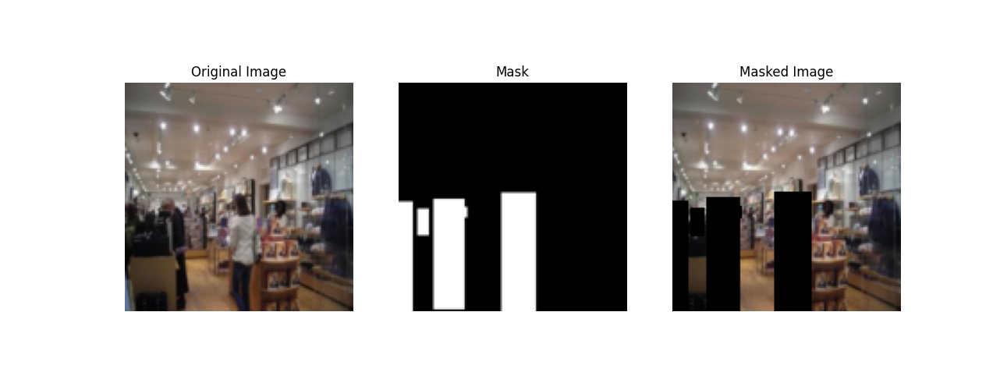

# EraseNet

This project focuses on developing a system for **object removal and scene reconstruction** using computer vision techniques, with an emphasis on image inpainting. The goal is to use pre-trained models to detect objects (e.g., cars, people) in images and then focus on creating a custom **inpainting solution** to reconstruct and fill the background where the objects once were. . The emphasis is on training an **auto-encoder from scratch** and experimenting with architectural innovations like **skip connections**, **dilated convolutions**, and varying network depths as the research component. This project is particularly useful for image editing and post-processing tasks where a clean background is required.

## Project Goals

- **Object Detection Using Pre-trained Models**: Utilize YOLOv8 for precise object detection to generate realistic object masks for inpainting.
- **Develop a Custom Inpainting Solution**: Train a tailored auto-encoder with innovations like skip connections and dilated convolutions to reconstruct masked regions.
- **Architectural Experimentation**:  Experiment with encoder-decoder architectures to optimize inpainting performance..
- **Scene Reconstruction**: Seamlessly fill masked regions with contextually relevant content.

## **Features**

### **1. Object Detection and Mask Generation**
- **Implementation**:
  - YOLOv8 is used for detecting objects in the training dataset.
  - Detected regions are masked and stored as binary masks for inpainting.
- **Purpose**:
  - Create realistic masked images to simulate object removal for the training pipeline.

### **2. Custom Inpainting Solution**
- **Implementation**:
  - A custom auto-encoder model with **skip connections** and **dilated convolutions** to enhance reconstruction accuracy.
  - Focuses on structural restoration using contextual cues from surrounding pixels.
- **Purpose**:
  - Seamlessly reconstruct masked regions with consistent textures, colors, and structural features.

### **3. Preprocessing and Feature Extraction**
- **Implementation**:
  - **Image Resizing and Normalization**: Standardize inputs to **128×128** for computational efficiency.
  - **YOLO-Based Masking**: Generate object masks using YOLO for realism.
  - **Edge and Contour Detection**: Extract structural cues like edges to guide the inpainting model.
- **Purpose**:
  - Enhance the dataset with realistic challenges and provide structural guidance to the inpainting model.

### **4. Evaluation Metrics**
- **Intersection Over Union (IoU)**:
  - Quantifies the overlap between predicted and ground truth regions.
- **Precision and Recall**:
  - Evaluate the accuracy of reconstructed regions.
- **Qualitative Visualization**:
  - Generate before-and-after comparisons for visual assessment.


## Key Considerations

- **Focus on Inpainting**: the project emphasizes developing a robust inpainting solution as the core research component using images.
- **Use of Pre-trained Models for Object Detection**: Object detection is handled using existing models to allow more focus on the inpainting task.
- **Architectural Exploration in Inpainting**: Training the auto-encoder from scratch provides an opportunity to contribute original work.
- **Structural Features over Color**: The inpainting model will focus on structural features like edges and textures, making the solution robust to various lighting conditions and color variations.
- **No Facial Recognition**: The project does not involve recognizing or focusing on facial features.
- **Use of Static Images**: The shift from video frames to images simplifies the data and allows for more controlled experimentation.
-----------------------------------------------------------------------------------------------------------------------------------------------------------------------------
## Part 2: Data Acquisition and Preparation

### 1. Introduction

To train and evaluate the custom inpainting models, a comprehensive and diverse dataset is essential. The **Places2** dataset, specifically the **Places365-Standard** subset, has been selected for its vast variety of scenes and suitability for image inpainting tasks. This dataset provides a challenging and diverse environment to test and train inpainting models.

### 2. Dataset Description

#### a. Source

- **Dataset**: Places2 Dataset (Places365-Standard)
- **Download Link**: [Places2 Dataset](http://places2.csail.mit.edu/download-private.html)
- **Associated Paper**: Zhou, B., et al. "Places: A 10 million Image Database for Scene Recognition." *IEEE Transactions on Pattern Analysis and Machine Intelligence*, vol. 40, no. 6, pp. 1452-1464, 2018.

#### b. Data Splitting Strategy

For this project, the dataset was split into subsets suitable for training, validation, and testing. The training and validation splits were derived from a reduced set of images (3000 images) prepared specifically for efficient inpainting experimentation. 

- **Training Set (80%)**: Contains approximately 2400 images for model training.
- **Validation Set (20%)**: Contains approximately 600 images to validate the model's performance.

#### c. Differences Between Training and Validation Subsets

- **Scene Diversity**: Both subsets are derived from the same dataset but contain different images to ensure that the model generalizes well to unseen samples.
- **Complexity and Conditions**: Training and validation subsets include diverse lighting, weather conditions, and scenes, covering the same 365 categories but with distinct images in each subset.

#### d. Number of Distinct Scenes and Samples

- **Scene Categories**: 365 distinct categories (e.g., beaches, forests, city streets, indoor rooms).
- **Samples per Category**: Thousands of images per category in the original dataset, with a balanced selection for the training and validation splits.

#### e. Characterization of Samples

- **Resolution**: All images were resized to **128×128 pixels** to reduce computational overhead while preserving contextual information.
- **Illumination and Ambient Conditions**: Images cover a wide range of environmental conditions, ensuring robustness during training.

---

## Methodology

### 1. Data Preparation

- **Image Organization**: Images were categorized into training and validation sets with balanced scenes.
- **Mask Generation**:
  - Used **YOLOv8** to detect objects and create binary masks for the detected regions.
  - Binary masks simulate object removal, marking regions for inpainting.
- **Normalization**: Pixel values were scaled to the **[0, 1]** range for consistency in neural network training.

### 2. Object Detection and Masking

- **YOLOv8 for Object Detection**:
  - YOLOv8 was employed to identify objects within the dataset.
  - Detected objects were masked to simulate real-world scenarios of object removal.
- **Realistic Masking**:
  - YOLO-based masks create realistic inpainting challenges by mimicking actual object removal scenarios.

### 3. Inpainting and Scene Reconstruction

- **Custom Auto-Encoder Architecture**:
  - **Baseline Model**: A basic auto-encoder was implemented as a starting point.
  - **Skip Connections**: Added to preserve high-frequency details during reconstruction.
  - **Dilated Convolutions**: Enabled the model to capture larger spatial contexts for improved reconstruction accuracy.
- **Training Strategy**:
  - The training subset of the Places2 dataset was used.
  - An **L1 loss function** was applied to optimize pixel-level similarity.
  - The model was evaluated and refined using the validation subset.

---

## Expected Outcomes

1. **Effective Inpainting Solution**:
   - A custom-trained auto-encoder capable of high-quality scene reconstruction, seamlessly restoring masked regions.

2. **Architectural Insights**:
   - Experimentation with skip connections, dilated convolutions, and depth variations will provide insights into their impact on inpainting performance.

3. **High-Quality Image Outputs**:
   - Final images will feature convincingly removed objects with reconstructed backgrounds suitable for applications like photo editing and content-aware image manipulation.

---

## Project Workflow

1. **Data Preparation**:
   - Organize the Places2 dataset into training and validation subsets.
   - Apply YOLOv8-based object detection to create realistic masks.

2. **Object Detection and Masking**:
   - Detect objects and generate binary masks simulating object removal.

3. **Inpainting Model Development**:
   - Train a custom auto-encoder with architectural innovations, including skip connections and dilated convolutions.
   - Experiment with variations in architecture to refine model performance.

4. **Image Reconstruction**:
   - Use the trained model to reconstruct masked regions in validation images.
   - Produce high-quality results that seamlessly integrate reconstructed regions with their surrounding context.
-----------------------------------------------------------------------------------------------------------------------------------------------------------------------------


## Part 3: Data Preprocessing, Segmentation, and Feature Extraction

This section provides an overview of the data preprocessing and feature extraction steps implemented to prepare the images for the inpainting model. Each step ensures consistency, realism, and high-quality input for the inpainting task.

---

### 1. Methods Applied for Data Preprocessing and Feature Extraction

The following steps were applied to each image in the dataset to create a robust training and validation pipeline for the inpainting model.

#### Data Preprocessing

- **Resizing and Normalization**: 
  - Images from the **Places365** dataset were resized to **128×128 pixels** for computational efficiency and normalized to the **[0, 1]** range to ensure consistency across all inputs.
  - This step standardizes the dataset, ensuring that the model receives inputs of uniform size and value range.

- **YOLOv8-Based Object Detection and Masking**:
  - **YOLOv8**, a pre-trained object detection model, was used to identify objects in the images.
  - Detected regions were masked using binary masks (setting the regions to black) to simulate object removal, creating realistic inpainting challenges.

#### Feature Extraction

- **YOLO-Based Masking**:
  - The project utilizes **YOLOv8** for object detection, generating binary masks for the detected regions.
  - These masks simulate object removal by blacking out the object regions in the images.
  - The masked images are then processed by the inpainting model to learn how to reconstruct the missing areas using surrounding contextual information.

- **Masked Region Reconstruction**:
  - Instead of applying traditional edge or contour detection, the focus is on **structural restoration** through the **auto-encoder architecture**.
  - The custom auto-encoder with **skip connections** and **contextual encoding** allows the model to directly interpret spatial relationships and reconstruct missing             regions without explicit edge or contour inputs.
  - This approach eliminates the need for additional preprocessing steps like edge detection, relying on the model's learned features to achieve high-quality inpainting.

This strategy aligns with the project's emphasis on training a custom inpainting solution by leveraging the structural information encoded in the YOLO-generated masks and the auto-encoder's architecture.


---

### 2. Justification of Methods

The chosen preprocessing and feature extraction methods were selected to simulate real-world challenges and enhance the model's ability to reconstruct realistic scenes.

#### Resizing and Normalization

- **Purpose**: Standardizing all images to the same size and scaling pixel values to a [0, 1] range ensures computational efficiency and model stability during training.
- **Justification**: These steps reduce variability in the input data, ensuring that the model learns features effectively without being affected by inconsistent image dimensions or pixel value ranges.

#### YOLOv8-Based Object Detection and Masking

- **Purpose**: YOLOv8 detects objects, generating realistic masks to simulate object removal scenarios.
- **Justification**: Using YOLO-based masks provides a realistic context for inpainting, as opposed to using random masks. This approach ensures that the model is trained on practical challenges, improving generalization for real-world applications.


---

### 3. Illustrations of Processing Steps

Below are sample illustrations of each step applied to the dataset, showing the transformation of images during preprocessing and feature extraction.

#### Original Image



These illustrations demonstrate the pipeline used to prepare images for training and validation, ensuring that the model receives consistent and meaningful inputs.

---

### 4. Code and Instructions

The complete code for data preprocessing, segmentation, and feature extraction is available in the repository. The steps are modularized into scripts, allowing for easy execution and integration into the training pipeline.

#### Code Overview

- `select_small_subset.py`: Selects a subset of images from the dataset for training and validation.
- `generate_yolo_masks.py`: Uses YOLOv8 to detect objects and generate binary masks for masked regions.
- `dataset.py`: Handles loading and preprocessing of images, applying YOLO-based masks and additional feature extraction.
- `train_small.py`: Trains the custom auto-encoder model using the processed dataset.

#### Instructions to Run

1. **Subset Selection**: Run `select_small_subset.py` to create a smaller, balanced subset of images for training and validation.
   ```bash
   python select_small_subset.py


